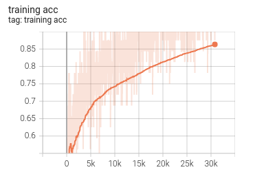
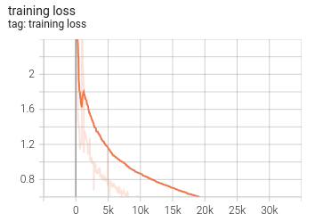

# PointNet_PyTorch
simple and clean implementation of "PointNet: Deep Learning on Point Sets for 3D Classification and Segmentation"


**This repo is only for classification.**

TNet Structure has been removed since it is not that necessary.

### Modelnet40 

Link: https://pan.baidu.com/share/init?surl=60v61B5bUH1ietY1Akg0HQ 

Pwd: 7w3s


### Training & Testing

```python
# training
python train.py

# testing
python test.py

# tensorboard
# cd outputs/runs
tensorboard -logdir tensorboard/
```


### Result

After 54 epochs training: 

 


### Reference

Qi C R, Su H, Mo K, et al. Pointnet: Deep learning on point sets for 3d classification and segmentation[C]//Proceedings of the IEEE conference on computer vision and pattern recognition. 2017: 652-660.

https://github.com/charlesq34/pointnet.git

https://github.com/fxia22/pointnet.pytorch.git
